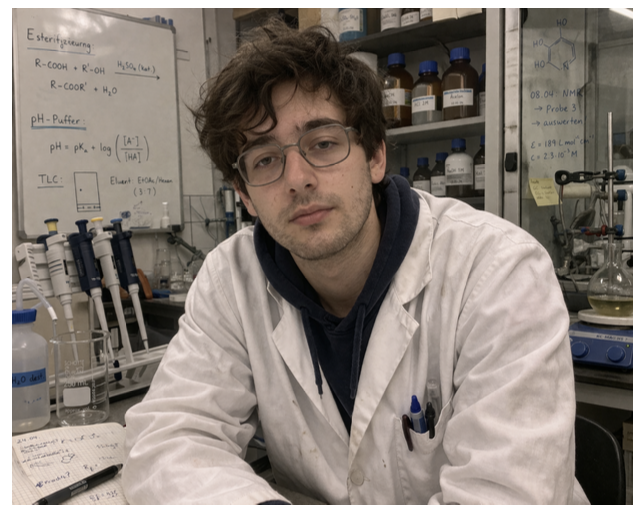

⁠ markdown
# Persona – Streamlit-App Nutzer

  

## Name, Alter
**Sebastian Müller, 25**

## Kurzbiografie
Sebastian lebt in Basel und studiert im 3. Jahr Chemie an der ZHAW. Aktuell arbeitet er intensiv an seiner Bachelorarbeit im Labor, wo er viele Experimente durchführen und auswerten muss. Sein Alltag ist geprägt von langen Arbeitszeiten, hoher Konzentration und Zeitdruck.

Er nutzt digitale Tools regelmässig, vor allem auf dem Laptop, um Berechnungen und Auswertungen durchzuführen. Effizienz ist für ihn wichtig, besonders wenn Deadlines näher rücken.

## Sebastians Problem
Sebastian muss viele Berechnungen und Datenauswertungen für seine Experimente durchführen. Dabei passieren ihm unter Zeitdruck oder Müdigkeit Fehler, die zu falschen Ergebnissen führen. Diese Fehler haben grosse Konsequenzen: Experimente müssen wiederholt werden, was Zeit kostet und zu negativen Rückmeldungen vom Betreuer führt.

Er braucht eine einfache, zuverlässige App, die ihm hilft, Berechnungen schnell und korrekt durchzuführen und Ergebnisse zu überprüfen.

## Bedürfnisse
- schnelle und fehlerfreie Berechnung von Experimentdaten
- einfache Eingabe von Werten ohne komplizierte Tools
- Möglichkeit zur Kontrolle und Überprüfung von Resultaten
- klare Darstellung der Ergebnisse
- Zeit sparen bei der Auswertung

## Ziele
- Experimente korrekt und effizient auswerten
- Fehler vermeiden und Wiederholungen reduzieren
- Zeit bei der Bachelorarbeit sparen
- bessere Rückmeldungen vom Betreuer erhalten
- Stress reduzieren

## Ängste und Hürden
- macht Fehler durch Müdigkeit oder Unkonzentriertheit
- verliert Zeit durch ineffizientes Arbeiten
- steht unter starkem Zeitdruck wegen Abgabe
- hat Angst vor falschen Resultaten und Kritik
- verliert Motivation, wenn Tools kompliziert sind

## Vorlieben und Abneigungen

### Vorlieben
- einfache, klare Benutzeroberflächen
- schnelle Resultate ohne viele Klicks
- Tools, die sofort funktionieren, ohne Installation
- visuelle Unterstützung, z. B. übersichtliche Ergebnisse

### Abneigungen
- komplizierte Programme
- lange Eingaben oder unnötige Funktionen
- unübersichtliche Darstellung
- Zeitverlust durch ineffiziente Tools

## Das ärgert Sebastian immer wieder
Viele Programme sind zu kompliziert oder benötigen zu viele Schritte für einfache Berechnungen. Oft muss er Daten manuell übertragen oder mehrfach überprüfen, was Zeit kostet und Fehlerquellen erhöht.

## Nutzung
- arbeitet hauptsächlich am Laptop im Labor oder zuhause
- nutzt digitale Tools regelmässig für das Studium
- arbeitet oft unter Zeitdruck
- macht viele Berechnungen und Auswertungen täglich

## Sebastians ideales Produkt
Ein Tool, das ihm sofort nach Eingabe der Daten automatisch korrekte Ergebnisse liefert und ihm Sicherheit gibt, dass seine Berechnungen stimmen, ohne zusätzliche Schritte oder komplizierte Einstellungen.

## Typisches Zitat
> „Ich will einfach schnell sicher sein, dass meine Berechnungen stimmen, ohne alles dreimal kontrollieren zu müssen.“

## Bezug zur Streamlit-App
Eure App hilft Sebastian konkret, indem sie:
- Berechnungen automatisiert
- Fehler reduziert
- Ergebnisse übersichtlich darstellt
- ihm Zeit spart und Stress reduziert
 ⁠